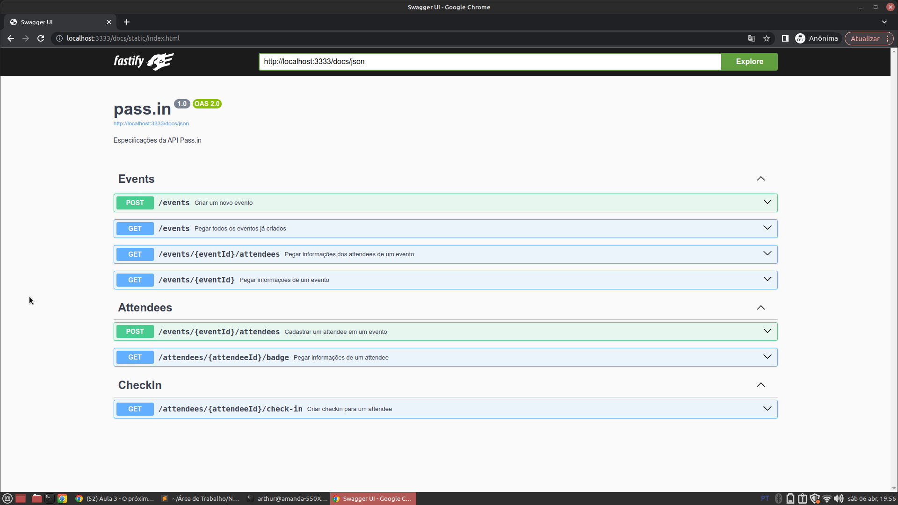

# [Português-Brasil]
# Pass.in API

# Introdução
Opa, tudo bom? O Pass.in API foi um projeto back-end desenvolvido no evento NLW-Unite da [Rocketseat](https://github.com/Rocketseat), que tem como foco fazer um projeto prático em três aulas usando uma tecnologia escolhida, neste caso, o NodeJS. 

---

## O que é / como funciona o Pass.in?
O Pass.in é uma API que permite o cliente criar novos eventos, cadastrar participantes e realizar Check-ins dos participantes dele. 



## Funcionalidades
### Rota: eventos
- [x] - Criar eventos, contendo nome, descrição e máximo de participantes
- [x] - Ver todos os eventos criados
- [x] - Ver quais participantes estão cadastrados em um evento específico
- [x] - Ver a descrição de um evento específico

### Rota: participantes
- [x] - Cadastrar um participante em um evento, enviando nome e e-mail
- [x] - Ver as informações de um participantes

### Rota: check-ins
- [x] - Fazer o check-in de um participante em um evento

## Tecnologias usadas


---

## Como iniciar o projeto?
1. Faça o clone deste repositório usando o git ou apenas baixando o projeto em "code > download zip"
	```bash
	git clone https://github.com/Arthur-Llevy/nlw-unite-rocketseat.git
	```

2. Extraia o projeto e abra ele no seu editor de código
3. Vá para a pasta "src" manualmente ou pela linha de comando
 	```bash
	cd src
	```
4. Baixe as dependências do projeto
 	```bash
	npm i
	```	
5. Execute o comando para iniciar o servidor 
 	```bash
	npx tsx watch --env-file .env ./server.ts 
	```
6. Será iniciado um servidor local na porta 3333 - http://localhost:3333/
7. Caso queira acessar a interface gráfica (swagger) vá para a rota [http://localhost:3333/docs/](http://localhost:3333/docs/)

### Visualizar base de dados
1. Execute o seguinte comando para ver a interface gráfica do banco de dados 
 	```bash
	npx prisma studio
	```
2. Será iniciada uma porta em http://localhost:5555/

Pronto! A API já está funcionando

Obrigado!

---
# [English]
# Pass.in API


# Introduction
Oops, how are you? The Pass.in API was a back-end project developed at the [Rocketseat](https://github.com/Rocketseat) NLW-Unite event, which focuses on doing a practical project in three classes using a chosen technology, in this case, NodeJS.

---

## What is / how does Pass.in work?
Pass.in is an API that allows customers to create new events, register participants and perform Check-ins for their participants.


## Functionalities
### Route: events
- [x] - Create events, containing name, description and maximum number of participants
- [x] - View all created events
- [x] - See which participants are registered for a specific event
- [x] - View the description of a specific event

### Route: participants
- [x] - Register a participant in an event, sending name and email
- [x] - View a participant's information

### Route: check-ins
- [x] - Check in a participant at an event

## Technologies used


---

## How to start the project?
1. Clone this repository using git or just download the project from "code > download zip"
```bash
git clone https://github.com/Arthur-Llevy/nlw-unite-rocketseat.git
```

2. Extract the project and open it in your code editor
3. Go to the "src" folder manually or via command line
  ```bash
cd src
```
4. Download project dependencies
  ```bash
npm i
```
5. Run the command to start the server
  ```bash
npx tsx watch --env-file .env ./server.ts
```
6. A local server will be started on port 3333 - http://localhost:3333/
7. If you want to access the graphical interface (swagger) go to the route [http://localhost:3333/docs/](http://localhost:3333/docs/)

### View database
1. Run the following command to see the database graphical interface
  ```bash
npx prisma studio
```
2. A port will be started at http://localhost:5555/

Ready! The API is now working

Thanks!
